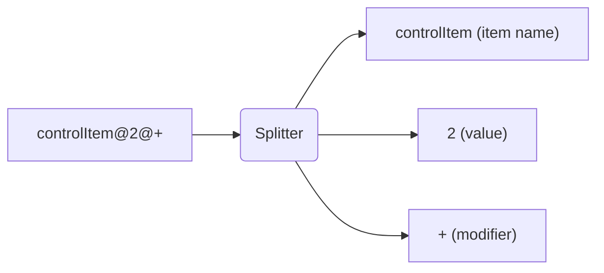

# Welcome!
This is the home to documentation of the 🗿 file format, which was made through studying of various sequences.

## 1. The file's structure
The structure of a 🗿 file is very simple. All items are separated with | characters, and can be easily be splitted with most programming languages. For example, `sequence.split('|')` is a way to do this in JavaScript.

## 2. Item structure
The simplest form that a sequence can be made is words split by | characters, like this: `sound|sound|sound|sound` \
However, as you look at multiple sequences in a text editor, you will see the `@` character appear often, which is a way to store extra data for the sound; more about that in the next section!

## 3. What are all these @s anyway?
As we talked about earlier, `@`s are used to store extra data for the sound. \
An example of using the @s can be demonstrated here: `sound@2|sound@3|sound@4|sound@5` \
"***But what does it all mean?***" you may ask. It turns out that these are as simple as separating the sounds. \
Let's break this down with a simple diagram:

As you can see, `controlItem` is the name of the item, or known as the ID. This is always a string. \
The value's purpose is different depending on the item name. If the item belongs to a regular sound, then it will control the pitch. Otherwise, if it belongs to a control item, it will be the value the control item handles. Make sure to make this a type that supports decimals!

The modifier is also item-specific, and only works for specific control items like speed and volume. There are only 3 possible modifiers, and those are: \
`+`, which means to add to the previous value, \
`x`, which means to multiply the previous value by the value you specify. \
The third one is... nothing at all! This instructs the site to set the tempo/volume, and not do any mathematical operations on it.

## 4. Efficiently combining items
(Thanks [@karbis](https://github.com/karbis) for this [discovery](https://user-images.githubusercontent.com/42378704/171949623-fc26bbdd-6d04-4b46-b7a3-801e95e01e31.png))

If you don't wanna put in the work of copying and pasting stuff over and over again, there's a much easier and compactor way of doing this.
Append `=n` to the end of your item (not the item ID! if you have `boom@0` do not put `boom=4@0`, instead put `boom@0=4`), replacing n with any number.

For example, if you try `boom=4|_pause=4|boom=4` and load this into the editor, you will get this:

Very simple!

## 5. Item types
If you recall, item IDs are always strings. This means that you can easily tell what sound is being played without having to look it up on a list or something.

### But how do I know what IDs to pick?
When I first started ThirtyDollarLib, I had to assemble all sounds into one sequence using the website, save it, and tediously construct an enum from there. Since the website has over 100 sounds, this would take over 5 minutes. (Constructing enums in C# from a list is basically impossible

Fortunately, the sound IDs, friendly names, and the sources of them are all stored in crisp and clean JSON format. You can view the JSON [here](https://thirtydollar.website/sounds.json), but sometimes browsers will mistakenly see this as a WAV file and download it in the wrong format. In case that happens, you can view a mirrored version of the JSON [here](https://github.com/ThirtyDollarLibraries/docs/blob/main/sounds.json).

The control IDs are a different story, as they need no JSON file since it will most likely never update. To get these, you have to look in the page's source, and grab the IDs there. I'm not gonna make you do that though, and just give you a cheat sheet.

Remember that ALL control items need to have an exclamation mark prefix!! (e.g. `!speed`)

| ID         | Name                 | Needs value? | Can use modifier? |
|------------|----------------------|--------------|-------------------|
| speed      | Set tempo            | ✅            | ✅                 |
| volume     | Set volume           | ✅            | ✅                 |
| stop       | Pause for duration   | ✅            | ❌                 |
| loopmany   | Loop                 | ✅            | ❌                 |
| loop       | Loop once            | ❌            | ❌                 |
| looptarget | Set loop start point | ❌            | ❌                 |
| cut        | Stop all sounds      | ❌            | ❌                 |
| combine    | Combine sounds       | ❌            | ❌                 |
| jump       | Go to target         | ✅            | ❌                 |
| target     | Target               | ✅            | ❌                 |
| flash      | Flash screen         | ❌            | ❌                 |
| startpos   | Set start position   | ❌            | ❌                 |

An extra undocumented control ID is `_pause`, which is to pause for 1 step. This is the "dot" in the website's sound picker.

## Conclusion
This is everything you need to get started on understanding the Thirty Dollar Website sequence file format, and can be useful for libraries made in the future! We're working on more libraries to put in the ThirtyDollarLibraries family, and if you have any suggestions, let us know via creating an issue in this repository, or if you have any contributions, submit a pull request!
